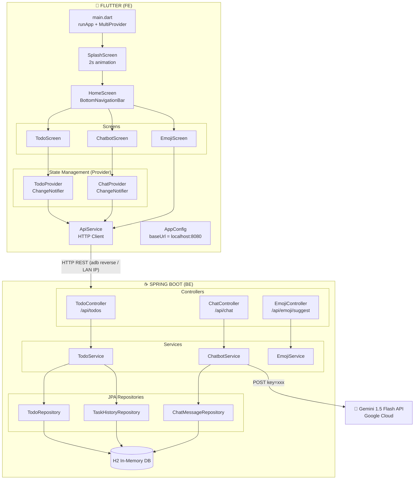
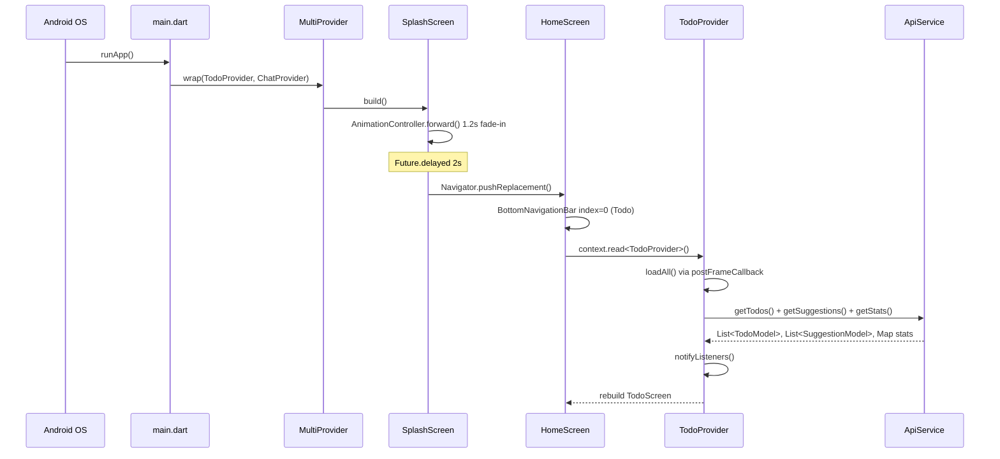
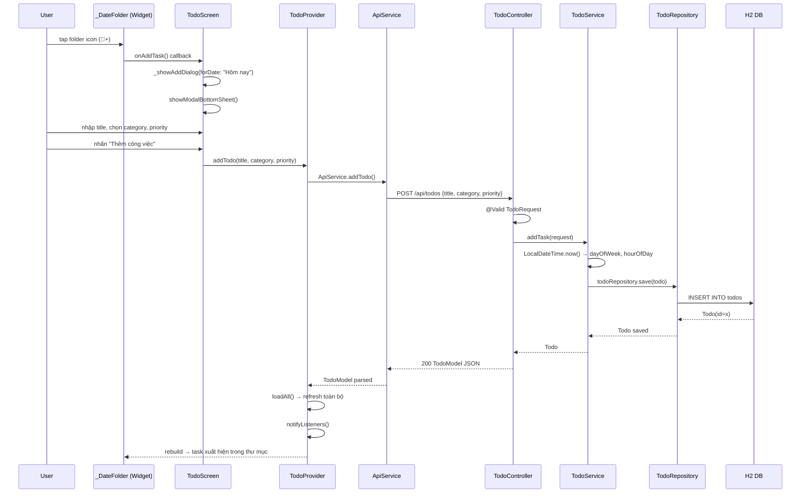
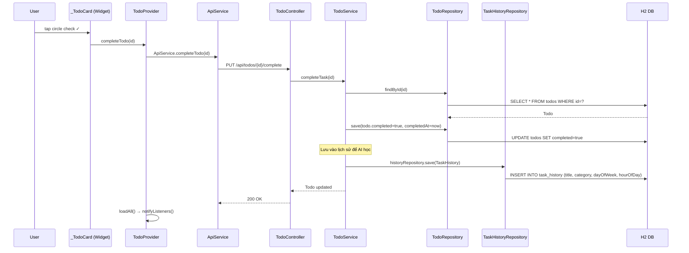
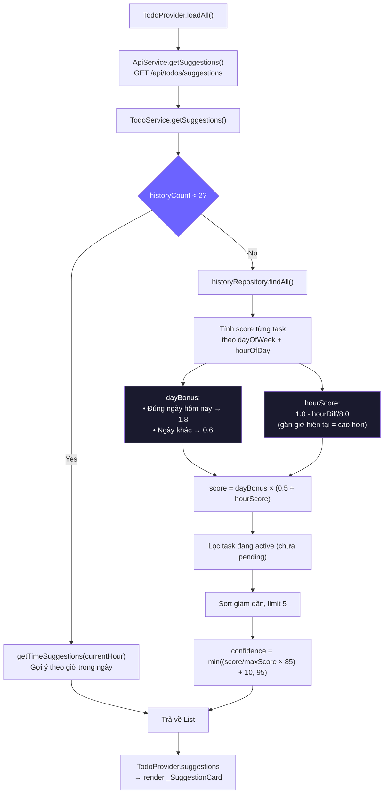
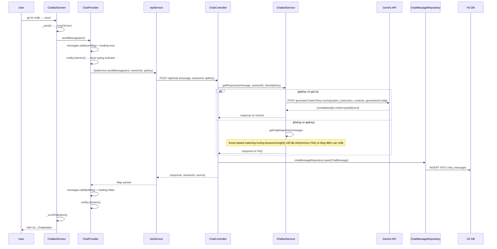
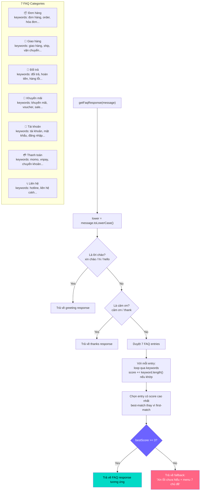
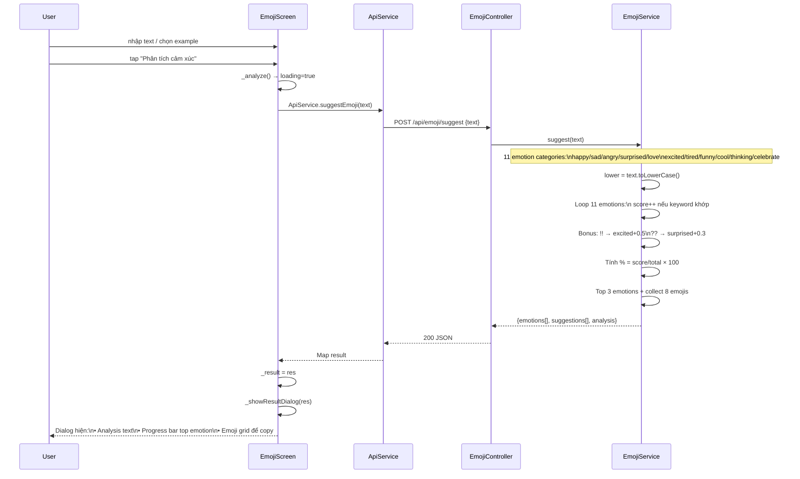
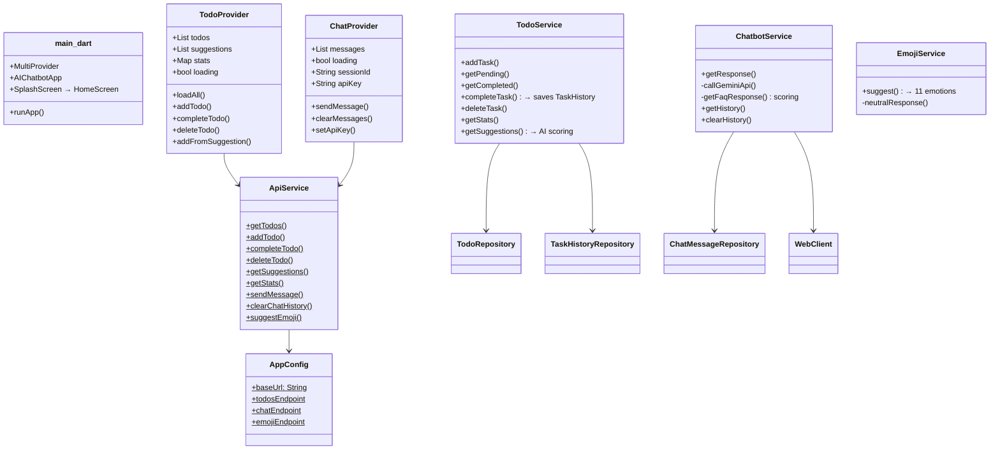

# Code Flow — Case Study 4: AI Chatbot

## Cách xem sơ đồ động
- **VS Code**: cài extension `Markdown Preview Mermaid Support` → mở file → Preview
- **Online**: copy từng block vào https://mermaid.live → export PNG/SVG
- **GitHub**: push lên GitHub → sơ đồ tự render trong README
- **Notion / Confluence**: paste trực tiếp, hỗ trợ Mermaid native
- **Draw.io**: import file `.drawio` (xem cuối file)
- **Obsidian**: hỗ trợ Mermaid native

---

## 1. Kiến trúc tổng quan

---

## 2. Luồng khởi động app

---

## 3. Luồng Todo — Thêm task

---

## 4. Luồng Todo — Hoàn thành task (AI học thói quen)

---

## 5. Luồng AI gợi ý Todo

---

## 6. Luồng CSKH Chatbot

---

## 7. Luồng FAQ Scoring (chi tiết)

---

## 8. Luồng Emoji AI

---

## 9. Sơ đồ class/data flow tổng hợp

---

## 10. Code Review — Điểm mạnh & cần cải thiện

### ✅ Điểm mạnh

| Phần | Nhận xét |
|------|----------|
| **Provider pattern** | Dùng đúng `ChangeNotifier`, tách state ra khỏi UI |
| **FAQ scoring** | Best-match theo keyword.length(), không bị first-match sai |
| **AI suggestions** | Scoring theo dayOfWeek + hourOfDay thực tế |
| **EmojiService** | 11 cảm xúc, xử lý `!!` và `??` pattern |
| **Gemini fallback** | Tự động fallback về FAQ khi API lỗi |
| **CORS config** | Cho phép mọi origin, phù hợp mobile dev |
| **Date folder UI** | Group theo ngày, today mặc định mở |

### ⚠️ Cần cải thiện

| Phần | Vấn đề | Gợi ý fix |
|------|--------|-----------|
| **H2 in-memory** | Mất data khi restart server | Dùng H2 file-based hoặc SQLite |
| **TodoProvider.loadAll()** | Gọi lại toàn bộ sau mỗi action (add/complete/delete) | Cập nhật local state thay vì refetch |
| **API key hardcode** | Key trong `application.properties` | Dùng env var khi deploy |
| **No error UI** | Lỗi mạng chỉ log, không hiện cho user | Thêm error banner/snackbar |
| **Chat history** | Không persist qua session | Dùng `shared_preferences` lưu local |
| **Todo no due date** | Không có deadline cho task | Thêm field `dueDate` vào model |

---

## Cách xuất file sơ đồ động

| Công cụ | Cách dùng | Output |
|---------|-----------|--------|
| **mermaid.live** | Copy từng block Mermaid → Edit | SVG, PNG, PDF |
| **VS Code** | Extension `Markdown Preview Mermaid Support` | Xem trực tiếp |
| **GitHub** | Push file .md lên repo | Tự render trong browser |
| **Draw.io** | File → Import → Mermaid | Kéo thả chỉnh sửa → export PNG/SVG/PDF |
| **Notion** | Tạo code block, chọn Mermaid | Render trong page |
| **PlantUML** | Chuyển sang PlantUML syntax | PNG/SVG/PDF/ASCII |
| **Lucidchart** | Import Mermaid | Chỉnh sửa drag-drop → export |
| **Excalidraw** | Vẽ tay từ sơ đồ | SVG/PNG style tay |
